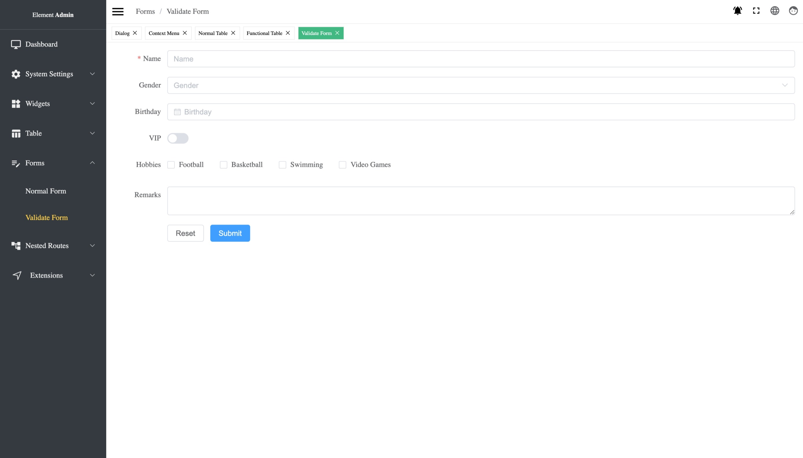

# Element Admin

A content management system using [Element Plus](https://element-plus.org/) and [Vue3](https://v3.vuejs.org/).

English | [中文](./README_ZH.md)



## Preview

[Element Admin](https://taipaxu.github.io/element-admin)

## Preparation

```sh
$ git clone  https://github.com/TaipaXu/element-admin
```

## Development

```sh
$ cd element-admin
$ npm i
$ npm run dev
```

## Building

```sh
$ npm run build
```

## License

[MIT License](LICENSE)
