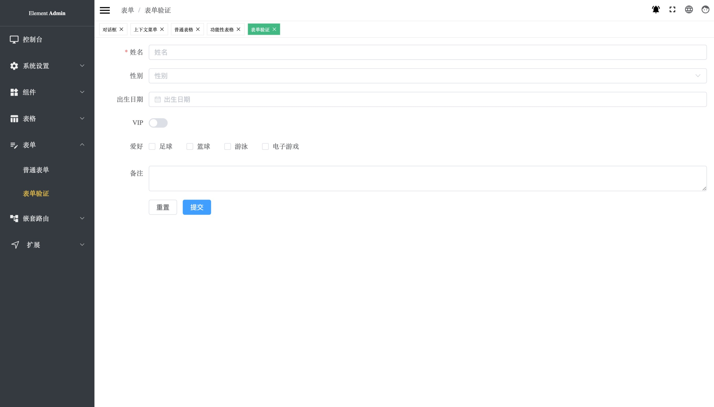

# Element Admin

一个使用 [Element Plus](https://element-plus.org/) 和 [Vue3](https://v3.vuejs.org/)的内容管理系统。

[English](./README.md) | 中文



## 预览

[Element Admin](https://taipaxu.github.io/element-admin)

## 准备

```sh
$ git clone  https://github.com/TaipaXu/element-admin
```

## 开发

```sh
$ cd element-admin
$ npm i
$ npm run dev
```

## 打包

需要安装 Python3

```sh
$ npm run build
```

## License

[MIT License](LICENSE)
